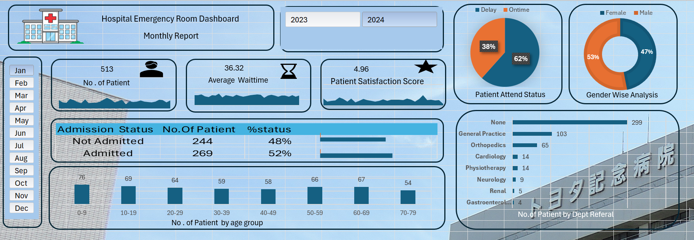

🏥 Hospital Emergency Room Dashboard – Excel Analytics Project

## 📸 Dashboard Preview

---

## 📌 Overview
This project is an **interactive Hospital Emergency Room Analytics Dashboard** built using **Microsoft Excel** to monitor and analyze:

👥 Patient Flow  
⏳ Waiting Time  
⭐ Satisfaction Score  
🏥 Department Referrals  

The dashboard transforms raw hospital data into **clear KPIs, dynamic charts, and actionable insights**, enabling faster and smarter healthcare decisions.

---

## 🎯 Objectives
✅ Track total patient visits  
✅ Monitor average waiting time  
✅ Measure patient satisfaction  
✅ Analyze admission vs non-admission rates  
✅ Identify department referrals  
✅ Understand age & gender trends  
✅ Enable monthly & yearly filtering  

---

## 📊 Dashboard Features

### 🔹 KPI Cards
- 👥 Total Patients
- ⏳ Average Wait Time
- ⭐ Patient Satisfaction Score

### 🔹 Visualizations
- 🟠 Patient Attend Status (Delay vs On-time)
- 👨‍⚕️ Gender Wise Analysis
- 📋 Admission Status Breakdown
- 📈 Age Group Distribution
- 🏥 Department Referral Analysis
- 📅 Daily & Monthly Trends

### 🔹 Interactivity
- 🗓️ Month Slicer (Jan–Dec)
- 📆 Year Filter (2023 / 2024)
- 🔄 Dynamic charts auto-update
- 🎛️ Fully interactive dashboard controls

---

## 🛠️ Tools & Skills Used
- 📊 Microsoft Excel
- Pivot Tables
- Pivot Charts
- Slicers
- KPI Cards
- Dashboard UI/UX Design
- Data Cleaning
- Data Visualization

---

## 📂 File Structure
hospital dashboard.xlsx
 ├── Dashboard
 ├── Pivot report
 ├── Daily ER patient
 ├── Average Wait time daily trends
 └── Satisfaction score

---

## 🚀 How to Use
1️⃣ Download the Excel file  
2️⃣ Open with **Microsoft Excel (2016 or later)**  
3️⃣ Navigate to **Dashboard sheet**  
4️⃣ Use slicers to explore data dynamically  

---

## 💡 Insights You Can Discover
📌 Peak patient months  
📌 Department workload  
📌 Waiting time efficiency  
📌 Satisfaction performance  
📌 Admission trends  
📌 Age group distribution  

---

## 🎯 Use Cases
Helpful for:
- 🏥 Hospital Management
- 📊 Healthcare Analysts
- ⚙️ Operations Teams
- 🧠 Decision Makers

---

## 🔮 Future Improvements
- 🚀 Power BI version
- 🔄 Automated refresh
- 🌐 Real-time database integration
- 📈 Predictive analytics
- 👨‍⚕️ Doctor performance KPIs

---

## 👤 Author
Sagar Lavate  
📊 Data Analyst | Excel | Power BI | SQL  

🔗 LinkedIn: https://www.linkedin.com/in/sagar-lavate 
---

⭐ If you found this project useful, feel free to star the repo!

